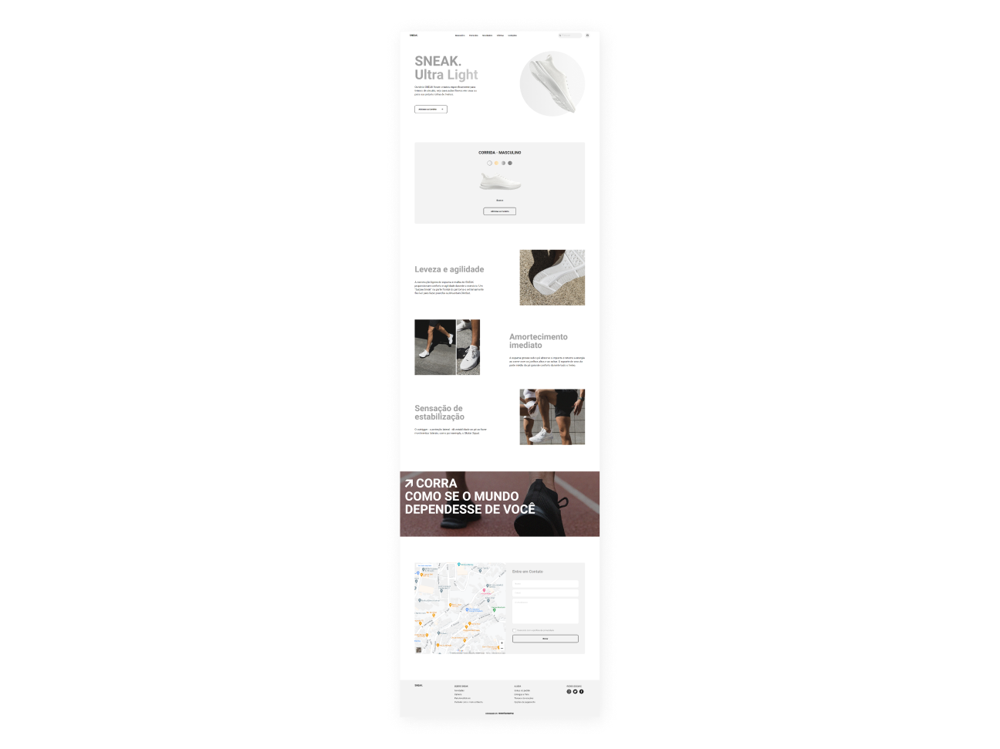

# 🖥️ Website Desktop Tenis SNEAK 👟🏃🏽‍♂️

Embora seja o segundo projeto do Curso de Desenvolvimento de Layout em Front-end da Mentorama, este foi o primeiro desafio empolgante de codar a primeira página web para a versão desktop.

 

## 👨🏾‍💻 Desafio do Projeto
 
O objetivo foi desenvolver um site para versão desktop a partir de inspeções de um protótipo do Figma.

 

## 📸 Screenshots

 

## 🚀 Tecnologias Utilizadas

- HTML5
- CSS3

 

## 🏆 Aprendizado 

- HTML Semântico
- Flexbox
- Variáveis CSS

 

## 🧠 Próximos Passos
- Avançar nos estudos de Flexbox para desenvolver um site adaptativo.
- Oraganizar o HTML e CSS utilizando a Metodologia BEM.

 

## 🔗 Projeto Hospedado no Vercel
Este projeto está disponível para visualização online através do Vercel.  
Você pode acessá-lo através do link: https://website-desktop-tenis-sneak.vercel.app/
